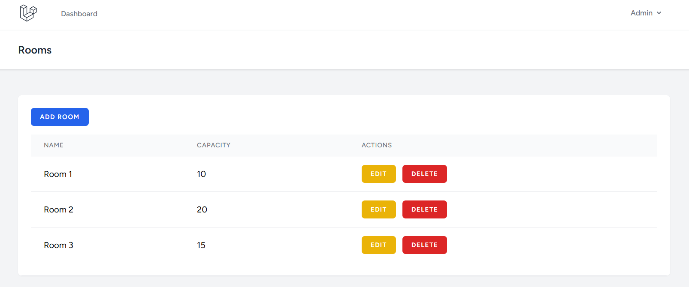

# Room Booking System


## Table of Contents
- [Overview](#overview)
- [Key Features](#key-features)
- [Technology Stack](#technology-stack)
- [Installation Guide](#installation-guide)
- [Configuration](#configuration)
- [User Guide](#user-guide)
- [Admin Guide](#admin-guide)

## Overview

A comprehensive room booking platform built with Laravel 12 featuring:
- Dual user roles (admin/regular users)
- Intuitive booking system with email notifications
- Modern responsive interface using Tailwind CSS
- Centralized room and booking management

## Key Features

### Responsive Design
- Mobile-friendly interface
- Intuitive navigation
- Consistent UI across devices

## Technology Stack

### Backend
- **Laravel 12.x** - Full-stack framework with Eloquent ORM
- **PHP 8.2+** - Required extensions: PDO, SQLite, OpenSSL
- **SQLite** - Lightweight database (no server required)
- **Mailtrap** - Email testing service (SMTP configuration)

### Frontend
- **Tailwind CSS 3.1** - Utility-first CSS framework
- **Alpine.js 3.4** - Lightweight JavaScript framework
- **Vite 6.x** - Next-generation build tool
- **Axios 1.8** - HTTP client for API calls

### Development Tools
- **Composer 2.x** - PHP dependency manager
- **Node.js 16+** - JavaScript runtime (LTS recommended)
- **Laravel Breeze** - Authentication scaffolding

## Installation

### Prerequisites
# Verify versions
```
php -v  # Requires >= 8.2
node -v  # Requires >= 16
composer --version  # Requires >= 2.0
```

### Setup Steps
1. Clone repository:
```
git clone https://github.com/Ali-Mannai/room-booking-system.git
cd room-booking-system
```

2. Install dependencies:
```
composer install
npm install
```

3. Configure environment:
```
cp .env.example .env
php artisan key:generate
```

4. Set up database:
```
touch database/database.sqlite
php artisan migrate:fresh --seed
```

5. Build assets:
```
npm run dev  # For development
# or
npm run build  # For production
```

6. Launch server:
```
php artisan serve
```

### Configuration
Edit `.env` file:
```
DB_CONNECTION=sqlite
DB_DATABASE=/absolute/path/to/database.sqlite

MAIL_MAILER=smtp
MAIL_HOST=smtp.mailtrap.io
MAIL_PORT=2525
MAIL_USERNAME=your_username
MAIL_PASSWORD=your_password
```

### Default Accounts
- Admin: `admin@roombooking.com` / `password`
- User: `user@roombooking.com` / `password`


### Default Accounts
- **Admin:** admin@roombooking.com / password
- **Regular User:** user@roombooking.com / password


## User Guide

### For Regular Users
1. **Account Creation**
   

2. **Secure Authentication System**
  

3. ### User dashboard


3. **Room Booking**
   

4. **Manage Bookings**
   

5. **Profile Management**
   

## Admin Guide

### Administrative Features
1. **Room Management Dashboard**
   

2. **Create New Rooms**
   

3. **Edit Existing Rooms**
   

4. **Delete Rooms**
   
